<div align="center">

# 🛡️ Malware Incident Analysis Report
### XMRig Cryptocurrency Miner — Forensic Investigation


</div>

---

## 📋 Table of Contents

- [Case Overview](#-case-overview)
- [How It Was Discovered](#-how-it-was-discovered)
  - [Investigation Tools Used](#investigation-tools-used)
  - [Investigation Timeline](#investigation-timeline)
- [Threat Summary](#-threat-summary)
- [File-by-File Analysis](#-file-by-file-analysis)
- [Indicators of Compromise (IOCs)](#-indicators-of-compromise-iocs)
  - [File System IOCs](#file-system-iocs)
  - [Network IOCs](#network-iocs)
  - [Attacker Wallet](#attackers-monero-wallet-address)
  - [Persistence IOCs](#persistence-iocs)
- [MITRE ATT&CK Mapping](#-mitre-attck-framework-mapping)
- [Why the Host AV Failed](#-why-the-host-antivirus-failed-to-detect-this)
- [Impact Assessment](#-impact-assessment)
- [Remediation Steps](#-remediation-steps)
- [Sample Preservation](#-sample-preservation--windowshostzip)
- [Key Learning Points](#-key-learning-points)
- [Conclusion](#-conclusion)

---

## 📁 Case Overview

| Field | Details |
|-------|---------|
| **Analyst** | Niraj |
| **Date of Discovery** | 2025 |
| **Date of Analysis** | May 16, 2026 |
| **Threat Type** | Cryptocurrency Miner (Cryptojacker) |
| **Malware Family** | XMRig |
| **Cryptocurrency Targeted** | Monero (XMR) |
| **Severity** | `HIGH` |
| **Status at Discovery** | `ACTIVE` |
| **Location** | `C:\Users\niraj\AppData\Roaming\windowshost\` |
| **Antivirus Detection (host AV)** | ⚠️ UNDETECTED — evaded the installed antivirus on the victim machine |
| **VirusTotal Reference** | [5379df3d28d8…1bc49bc3](https://www.virustotal.com/gui/file/5379df3d28d83164b24cfa02833233514958652eca489b968ff6e36b1bc49bc3) |

---

## 🔍 How It Was Discovered

The malware was **not detected by the antivirus running on the host**. It was discovered through manual investigation after observing suspicious system behavior:

> Upon laptop startup, CPU/memory usage immediately spiked to **~80%** before any user applications were opened. This abnormal resource consumption at boot time raised suspicion and triggered a manual investigation.

### Investigation Tools Used

| Tool | Purpose in Investigation |
|------|--------------------------|
| **Task Manager** | Initial detection — observed unusual high CPU and listed `svchost32.exe` in the Details tab |
| **Process Explorer** | Confirmed `svchost32.exe` as a non-Microsoft process consuming excessive CPU and memory |
| **Autoruns** | Located the persistence entry — `WindowsHostService` scheduled task pointing to `runhidden.vbs` |
| **Task Scheduler** | Verified the persistence trigger and the exact command line |
| **Process Monitor** | Captured live Stratum mining traffic from `svchost32.exe` to a remote pool |
| **TCPView** | Confirmed the established outbound TCP connection to the mining pool |
| **RamMap** | Quantified the memory footprint of `svchost32.exe` |
| **Notepad / Text Editor** | Inspected `runhidden.vbs`, `config.json`, and `SHA256SUMS` |

### Investigation Timeline

**Step 1 — Symptom Observed**
Laptop boots with ~80% CPU usage, no user apps open.

**Step 2 — Task Manager**
Suspicious `svchost32.exe` visible in the Details tab.

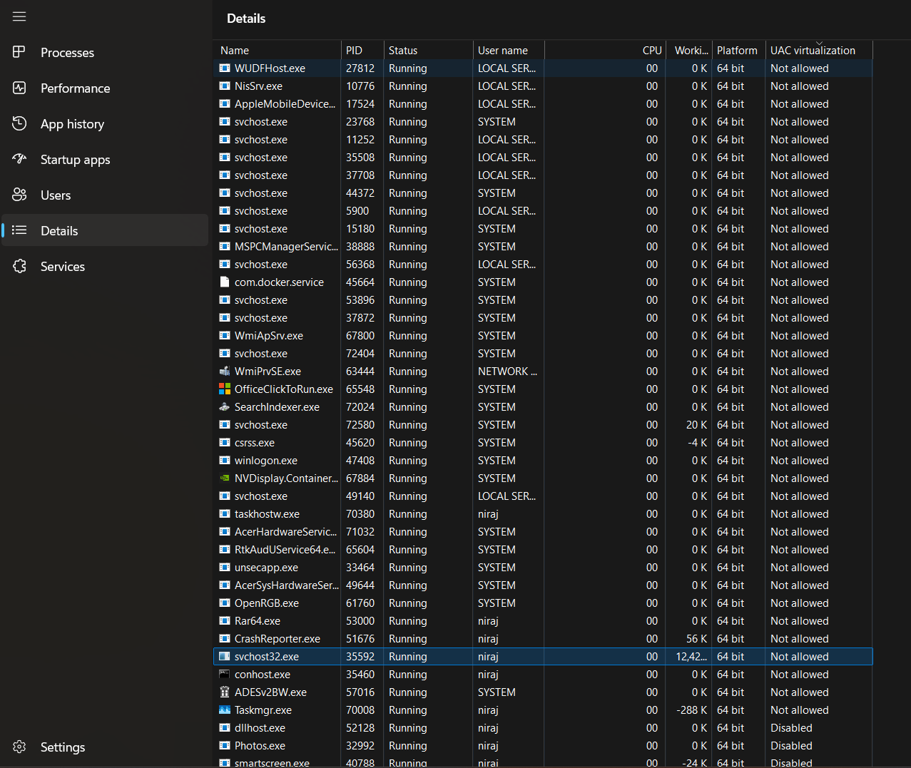
> **Behaviour:** Shows the renamed miner running alongside legitimate `svchost.exe` instances.  
> **Use case:** First visual confirmation that an unknown process is masquerading as a system process.

**Step 3 — Process Explorer**
Inspected the process to see private bytes, working set, and threads.

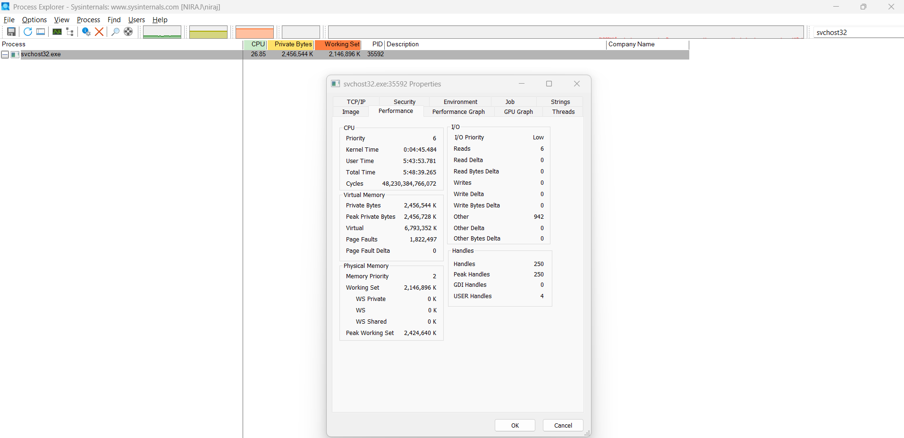
> **Behaviour:** `svchost32.exe` (PID 35592) holds ~2.45 GB working set with heavy CPU cycles.  
> **Use case:** Quantifies the resource theft caused by the miner.

**Step 4 — Located the Malware Folder**
Drilled into `AppData\Roaming\windowshost\`.

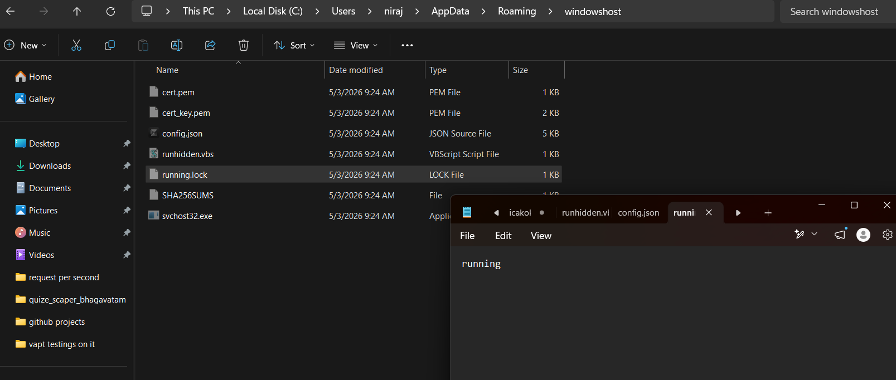
> **Behaviour:** 7 files staged in user AppData — exe, vbs, config, lock, certs, hash list.  
> **Use case:** Enumerates every artifact dropped by the attacker.

**Step 5 — Inspected `runhidden.vbs`**
The hidden launcher used at logon.

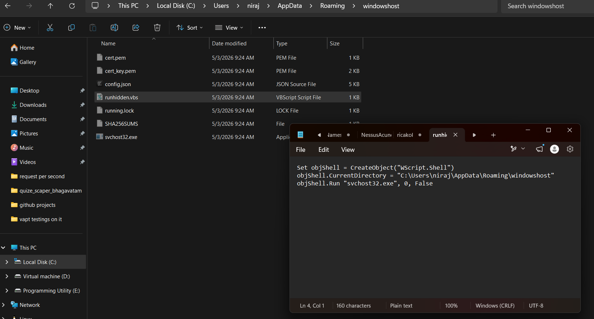
> **Behaviour:** Launches `svchost32.exe` with window style `0` (hidden) using `WScript.Shell.Run`.  
> **Use case:** Explains how the miner runs with no visible window or console.

**Step 6 — Inspected `config.json`**
XMRig configuration with mining pool and wallet.

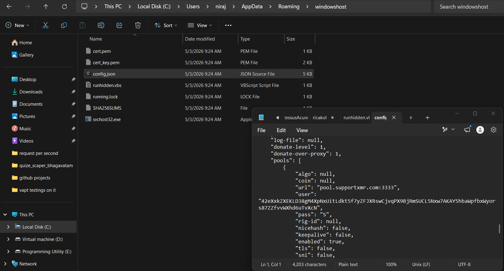
> **Behaviour:** Pool URL `pool.supportxmr.com:3333`, attacker wallet, `tls:false`, `nicehash:false`.  
> **Use case:** Extracts the mining pool, wallet address, and protocol IOCs.

**Step 7 — Inspected `SHA256SUMS`**
Confirms the binary origin.

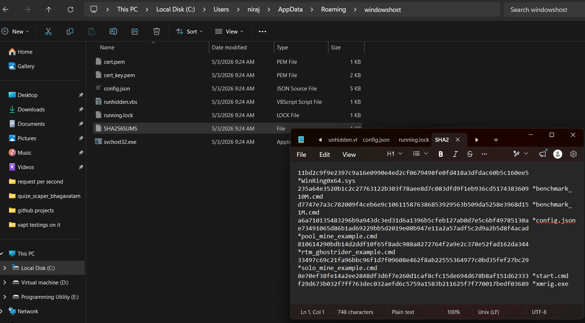
> **Behaviour:** Lists hashes for `xmrig.exe`, `WinRing0x64.sys`, `config.json`, and helper scripts.  
> **Use case:** Proves the dropped binary is an official XMRig 6.24.0 build, only renamed.

**Step 8 — Process Monitor**
Built a filter for `svchost32.exe` / `xmrig.exe` to capture mining activity.

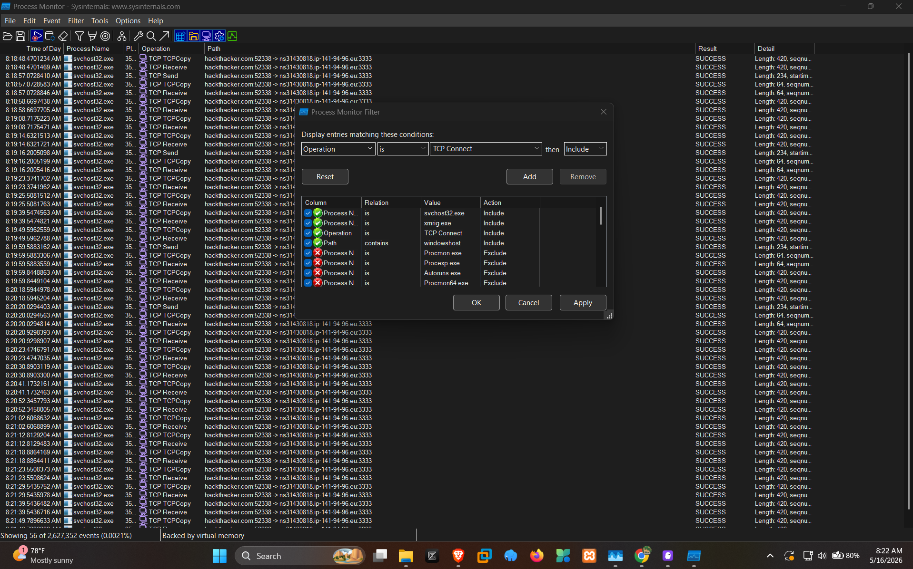
> **Behaviour:** Includes `svchost32.exe` and `xmrig.exe`; excludes `windowshost`, `Procmon`, `Procexp`, `Autoruns`.  
> **Use case:** Documents the exact investigation methodology used to isolate miner events.

**Step 9 — Captured Stratum Traffic**
Live TCP send/receive events to the pool.

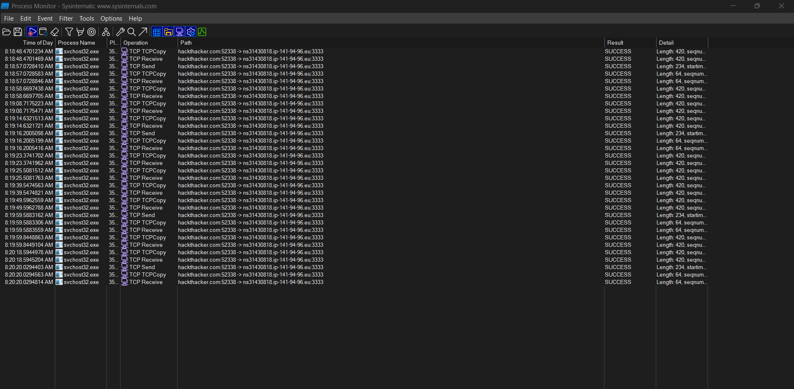
> **Behaviour:** Continuous TCP Send/Receive frames between `svchost32.exe` and `ns31430818.ip-141-94-96.eu:3333`.  
> **Use case:** Live evidence of active Stratum mining communication.

**Step 10 — TCPView**
Confirmed the established outbound connection.

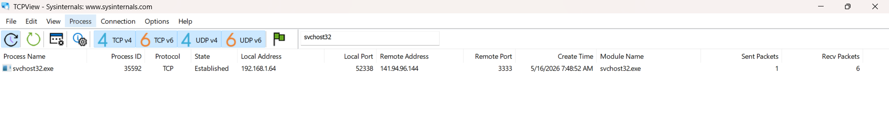
> **Behaviour:** `svchost32.exe` PID 35592 — `192.168.1.64:52338 → 141.94.96.144:3333`, state `ESTABLISHED`.  
> **Use case:** Pins down the live remote IP, port, and source PID for IOC and firewall blocking.

**Step 11 — RamMap**
Confirmed memory consumption.

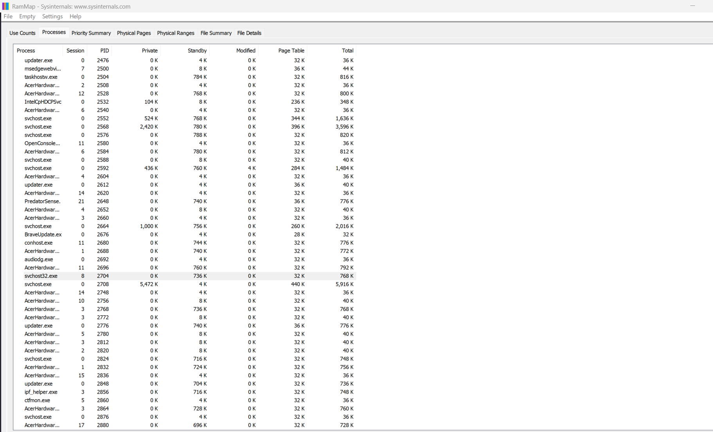
> **Behaviour:** `svchost32.exe` shows a multi-MB total/working set among normal services.  
> **Use case:** Corroborates the memory impact reported by Process Explorer.

**Step 12 — Autoruns**
Discovered the persistence entry.

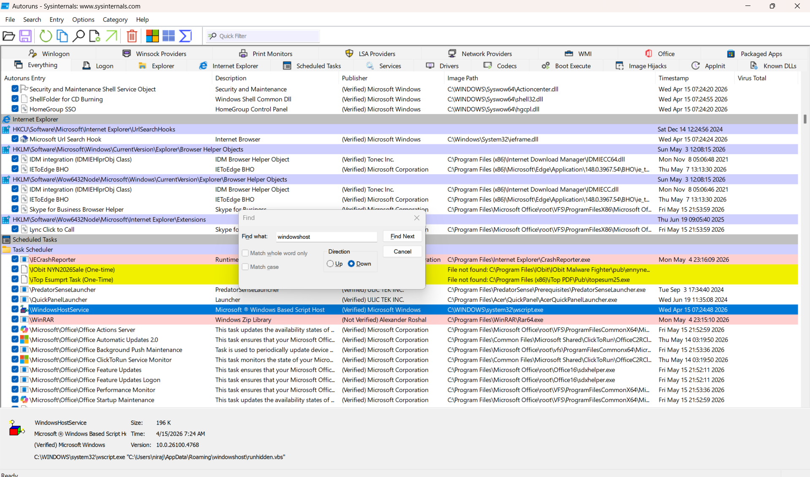
> **Behaviour:** Search for "windowshost" reveals a scheduled task named `WindowsHostService`.  
> **Use case:** Identifies the autostart mechanism keeping the miner alive across reboots.

**Step 13 — Task Scheduler**
Verified the persistence trigger and command.

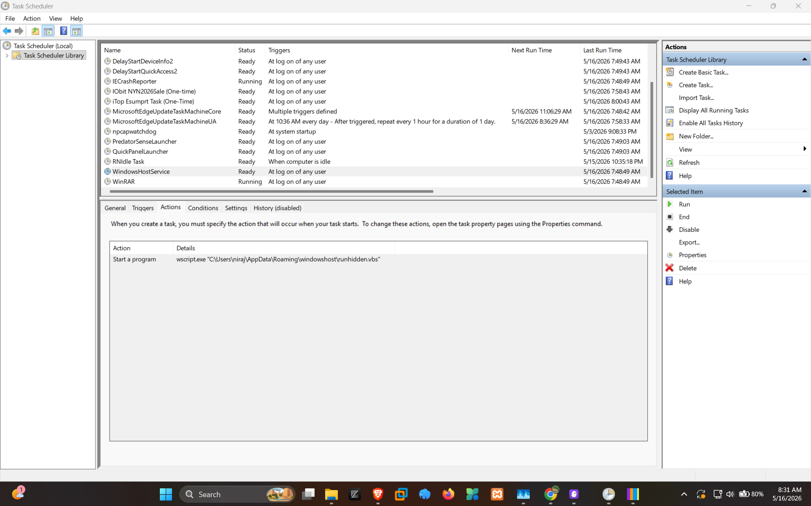
> **Behaviour:** Task `WindowsHostService` runs `wscript.exe "C:\Users\niraj\AppData\Roaming\windowshost\runhidden.vbs"` at logon.  
> **Use case:** Confirms exactly how, when, and with what command the miner is auto-launched.

---

## 🧩 Threat Summary

This is a **trojanized XMRig cryptocurrency miner** disguised as a legitimate Windows system process. The attacker renamed the XMRig mining executable to `svchost32.exe` to mimic the legitimate Windows service host process (`svchost.exe`). The malware completely evaded the host antivirus and was only found through manual forensic investigation.

The sample has been independently confirmed as a Monero miner on **VirusTotal** — most major engines flag it as `XMRig`, `CoinMiner`, or `BitMiner` (categories: miner / trojan / pua).

> 🔗 Reference: [VirusTotal Report — 5379df3d...](https://www.virustotal.com/gui/file/5379df3d28d83164b24cfa02833233514958652eca489b968ff6e36b1bc49bc3)

---

## 🗂️ File-by-File Analysis

### 1. `svchost32.exe` — Main Malicious Executable

| Property | Value |
|----------|-------|
| **True Identity** | XMRig Miner (renamed from `xmrig.exe`) |
| **Disguised As** | Windows Service Host (`svchost.exe`) |
| **Purpose** | Mines Monero cryptocurrency using victim's CPU |
| **Original Hash (from SHA256SUMS)** | `f29d673b032f7ff763dec032aefd6c5759a1583b211625f7f770017bedf03689` |
| **Host AV Detection** | `NONE` — undetected by installed antivirus |
| **VirusTotal** | Flagged as XMRig / CoinMiner by majority of engines |

**Why it evades the host antivirus:**
- XMRig is technically "legitimate" mining software — many AV vendors classify it as PUA (Potentially Unwanted Application).
- Placed in a user directory where AV real-time scanning may have exclusions.
- The renamed filename avoids signature rules targeting `xmrig.exe`.
- VBScript indirection adds another layer of evasion.

---

### 2. `config.json` — Mining Configuration

| Setting | Value | Meaning |
|---------|-------|---------|
| **Mining Pool** | `pool.supportxmr.com:3333` | Public Monero mining pool |
| **Wallet Address** | `42eXxkZXEKLD38gM4XpNxUitLdkt5f7yZFJXRswCjvqPX9BjRmSUCL5Nxw7AKAY5hbaWpfbxWyors87ZZfvvWXhd6uTvXcN` | Attacker's Monero wallet |
| **Worker Password** | `S` | Pool authentication token |
| **CPU Mining** | Enabled — ALL 16 threads | Maximum resource theft |
| **GPU Mining (OpenCL)** | Disabled | — |
| **GPU Mining (CUDA)** | Disabled | — |
| **Background Mode** | `true` | Runs silently, no visible window |
| **Pause on Active** | `false` | Does NOT stop when user is active |
| **Pause on Battery** | `false` | Does NOT stop on battery power |
| **Donate Level** | 1% | Minimal donation to XMRig developers |
| **HTTP API** | Disabled | No remote monitoring interface exposed |
| **Algorithm** | RandomX (auto) | Monero's proof-of-work algorithm |
| **Huge Pages** | Enabled | Optimizes mining performance |
| **TLS** | Disabled | Unencrypted pool connection |

**Critical observations:**
- Uses **all 16 CPU threads** at maximum intensity — explains the 80% resource usage at startup.
- `pause-on-active: false` means it **never stops**, even when the user is working.
- `pause-on-battery: false` drains laptop battery aggressively.
- `background: true` ensures no visible console window appears.

---

### 3. `runhidden.vbs` — Stealth Launcher (Persistence Mechanism)

```vbs
Set objShell = CreateObject("WScript.Shell") 
objShell.CurrentDirectory = "C:\Users\niraj\AppData\Roaming\windowshost" 
objShell.Run "svchost32.exe", 0, False 
```

| Property | Value |
|----------|-------|
| **Purpose** | Launches the miner with a completely hidden window |
| **Technique** | `WScript.Shell.Run` with window style `0` (SW_HIDE) |
| **Blocking** | `False` — script exits immediately after launch |
| **Trigger** | Scheduled task `WindowsHostService` at logon |

The VBScript itself contains no overtly malicious code — it simply runs an executable — which is why it is not flagged by signature-based AV.

---

### 4. `running.lock` — Process Lock File

| Property | Value |
|----------|-------|
| **Content** | `running` |
| **Purpose** | Indicates the miner is currently active |
| **Mechanism** | Prevents multiple instances from running simultaneously |

---

### 5. `cert.pem` & `cert_key.pem` — TLS Certificate & Private Key

| Property | Value |
|----------|-------|
| **Subject** | `localhost` |
| **Issued** | April 21, 2025 |
| **Expires** | April 19, 2035 (10-year validity) |
| **Key Type** | RSA 2048-bit |
| **Type** | Self-signed |

The HTTP API is disabled in `config.json`, but these certificates are bundled for the optional XMRig HTTPS API endpoint.

---

### 6. `SHA256SUMS` — Origin Verification File

This file lists hashes for the original XMRig distribution, confirming the malware's source:

| Original File | Purpose |
|---------------|---------|
| `xmrig.exe` | The miner binary (renamed to `svchost32.exe`) |
| `WinRing0x64.sys` | Kernel driver for MSR register access |
| `config.json` | Mining configuration |
| `start.cmd` | Original start script |
| `benchmark_10M.cmd` / `benchmark_1M.cmd` | Benchmark scripts |
| `pool_mine_example.cmd` | Pool mining example |
| `rtm_ghostrider_example.cmd` | GhostRider algorithm example |
| `solo_mine_example.cmd` | Solo mining example |

---

## 🚨 Indicators of Compromise (IOCs)

### File System IOCs

| Type | Indicator |
|------|-----------|
| Directory | `C:\Users\niraj\AppData\Roaming\windowshost\` |
| Executable | `svchost32.exe` (SHA256: `f29d673b032f7ff763dec032aefd6c5759a1583b211625f7f770017bedf03689`) |
| VBS Launcher | `runhidden.vbs` |
| Lock File | `running.lock` (contains `running`) |
| Config | `config.json` (XMRig format with pool/wallet) |
| Certificate | `cert.pem` (self-signed, CN=localhost) |
| Private Key | `cert_key.pem` (RSA 2048-bit) |

### Network IOCs

| Type | Indicator |
|------|-----------|
| Mining Pool Domain (config) | `pool.supportxmr.com` |
| Resolved Pool Endpoint (observed) | `ns31430818.ip-141-94-96.eu` / `141.94.96.144` |
| Port | `3333` (Stratum protocol) |
| Protocol | TCP/Stratum (unencrypted) |
| Source Port (observed) | `52338` |
| Connection Type | Persistent outbound, `ESTABLISHED` |

### Attacker's Monero Wallet Address

```
42eXxkZXEKLD38gM4XpNxUitLdkt5f7yZFJXRswCjvqPX9BjRmSUCL5Nxw7AKAY5hbaWpfbxWyors87ZZfvvWXhd6uTvXcN
```

### Persistence IOCs

| Location | What to Look For |
|----------|------------------|
| Task Scheduler | Task named `WindowsHostService` running `wscript.exe runhidden.vbs` |
| `HKCU\Software\Microsoft\Windows\CurrentVersion\Run` | Entries pointing to `runhidden.vbs` |
| `HKLM\Software\Microsoft\Windows\CurrentVersion\Run` | Entries pointing to `runhidden.vbs` |
| `shell:startup` folder | Shortcut or VBS file |

---

## 🗺️ MITRE ATT&CK Framework Mapping

| Technique ID | Tactic | Name | Usage in This Attack |
|:------------:|--------|------|----------------------|
| [T1496](https://attack.mitre.org/techniques/T1496/) | Impact | Resource Hijacking | CPU used for Monero mining |
| [T1036.005](https://attack.mitre.org/techniques/T1036/005/) | Defense Evasion | Masquerading: Match Legitimate Name | `svchost32.exe` mimics `svchost.exe` |
| [T1059.005](https://attack.mitre.org/techniques/T1059/005/) | Execution | Command and Scripting Interpreter: Visual Basic | `runhidden.vbs` launches the miner |
| [T1564.003](https://attack.mitre.org/techniques/T1564/003/) | Defense Evasion | Hide Artifacts: Hidden Window | Window style `0` hides process |
| [T1053.005](https://attack.mitre.org/techniques/T1053/005/) | Persistence | Scheduled Task/Job: Scheduled Task | `WindowsHostService` task at logon |
| [T1547.001](https://attack.mitre.org/techniques/T1547/001/) | Persistence | Boot or Logon Autostart Execution: Registry Run Keys | (alternate persistence vector to check) |
| [T1071](https://attack.mitre.org/techniques/T1071/) | Command and Control | Application Layer Protocol | Stratum mining protocol over TCP |
| [T1027](https://attack.mitre.org/techniques/T1027/) | Defense Evasion | Obfuscated Files or Information | Renamed binary, indirect execution |
| [T1074.001](https://attack.mitre.org/techniques/T1074/001/) | Collection | Data Staged: Local Data Staging | All components staged in `AppData\Roaming` |

---

## 🛡️ Why the Host Antivirus Failed to Detect This

| Evasion Technique | Explanation |
|-------------------|-------------|
| **Legitimate Tool Abuse** | XMRig is open-source mining software; many AV vendors classify it as PUA, not malware, and may not block it by default. |
| **File Renaming** | Renaming `xmrig.exe` to `svchost32.exe` bypasses filename-based detection signatures. |
| **Living-off-the-Land** | Uses Windows-native VBScript (`wscript.exe`) for execution — a trusted Microsoft binary. |
| **User-Space Location** | `AppData\Roaming` is a legitimate application data folder; some AV products reduce scanning intensity here. |
| **No Exploit Code** | The malware contains no shellcode, exploits, or traditionally "malicious" code patterns. |
| **Indirect Execution** | VBS → EXE chain adds indirection that breaks simple behavioral detection. |

> **Note:** While the **host AV missed it**, VirusTotal cross-checks ([sample report](https://www.virustotal.com/gui/file/5379df3d28d83164b24cfa02833233514958652eca489b968ff6e36b1bc49bc3)) show that the majority of engines do recognize this binary as XMRig / CoinMiner — the failure was specific to the host's installed product.

---

## 📊 Impact Assessment

| Impact Area | Severity | Description |
|-------------|:--------:|-------------|
| **CPU Usage** | 🔴 CRITICAL | All 16 CPU threads consumed at 100% capacity |
| **System Performance** | 🔴 HIGH | System extremely slow, 80% resources consumed at boot |
| **Battery Life** | 🔴 HIGH | Laptop battery drains rapidly due to constant full CPU load |
| **Electricity Cost** | 🟡 MEDIUM | Increased power consumption at victim's expense |
| **Hardware Lifespan** | 🟡 MEDIUM | Prolonged 100% CPU usage causes thermal stress |
| **Network** | 🟢 LOW | Constant outbound connection to mining pool |
| **Data Theft** | ✅ NONE OBSERVED | No data exfiltration capability detected in this configuration |
| **Privacy** | 🟢 LOW | Wallet address and pool connection expose attacker's identity |

---

## 🔧 Remediation Steps

### Phase 1 — Immediate Containment

1. **Kill the process** — Open Task Manager → find `svchost32.exe` → End Task.
2. **Disconnect from network** — Prevent further communication with the mining pool.
3. **Verify process is dead** — Use Process Explorer to confirm no child processes remain.

### Phase 2 — Remove Persistence

4. **Open Task Scheduler** (`taskschd.msc`) → delete the `WindowsHostService` task.
5. **Open Autoruns** (run as Administrator) → remove any entry referencing `runhidden.vbs`, `svchost32.exe`, or `windowshost`.
6. **Check the registry** for any backup persistence:
   ```
   HKCU\Software\Microsoft\Windows\CurrentVersion\Run
   HKLM\Software\Microsoft\Windows\CurrentVersion\Run
   HKCU\Software\Microsoft\Windows\CurrentVersion\RunOnce
   ```
7. **Check Startup folders:** `shell:startup` and `shell:common startup`.

### Phase 3 — Remove Malware Files

8. **Delete the entire malware directory:**
   ```cmd
   rmdir /s /q "C:\Users\niraj\AppData\Roaming\windowshost"
   ```
9. **Search for related files** — Check for copies in:
   - `C:\Users\niraj\AppData\Local\Temp\`
   - `C:\ProgramData\`
   - Other user profiles

### Phase 4 — Block & Verify

10. **Block the mining pool / observed IP** at the firewall:
    ```cmd
    netsh advfirewall firewall add rule name="Block Mining Pool" dir=out action=block remoteip=141.94.96.144
    netsh advfirewall firewall add rule name="Block SupportXMR" dir=out action=block remoteip=pool.supportxmr.com
    ```
11. **Monitor CPU usage** for 48 hours to confirm mining has stopped.
12. **Run full antivirus scan** with updated definitions (consider Malwarebytes or HitmanPro as a secondary scanner).

### Phase 5 — Post-Incident

13. **Change all passwords** — Assume credentials may be compromised.
14. **Investigate infection vector** — phishing, cracked software, drive-by download, or USB?
15. **Check for additional payloads** — the dropper may have installed other malware.
16. **Audit AV exclusions** — ensure `AppData\Roaming` is not excluded from scanning.

---

## 🗜️ Sample Preservation — `windowshost.zip`

The complete malware folder has been compressed into **`windowshost.zip`** and kept alongside this report for educational and incident-response purposes.

> ⚠️ **WARNING:** `windowshost.zip` contains a **live, working XMRig miner**. Do **not** unzip or execute it on any production or personal system.

### Safe Analysis Environments

| Environment | Notes |
|-------------|-------|
| **VMware Workstation / Player** | Use a Windows VM with networking set to **Host-only** or NAT with the mining pool blocked. Take a clean snapshot before extraction so you can roll back. |
| **VirtualBox** | Same precautions — host-only networking, snapshot first, no shared folders mounted as writable to the host. |
| **Windows Sandbox** | Lightweight isolated container shipped with Windows 10/11 Pro+. Files inside the sandbox are discarded on close, which is ideal for one-shot inspection. |
| **REMnux + FLARE VM** | Recommended dual-VM setup for static + dynamic analysis with full network capture (Wireshark, INetSim). |

### Recommended Workflow Inside the VM

1. Disable internet access (or route through INetSim/FakeNet) before unzipping.
2. Calculate hashes of every file and compare with the `SHA256SUMS` shipped in the archive.
3. Open `config.json`, `runhidden.vbs`, and `SHA256SUMS` in a text viewer — they are plain text.
4. Run static analysis on `svchost32.exe` (PE-bear, CFF Explorer, DIE) **without executing**.
5. Only execute under controlled conditions (Process Monitor + Wireshark running) if dynamic behavior is needed.
6. Revert the snapshot when done.

### Recommended Analysis Tools

| Tool | Purpose |
|------|---------|
| **VirusTotal** | Cross-engine detection — sample report linked above |
| **Wireshark** | Capture Stratum traffic to the mining pool |
| **x64dbg / IDA Free** | Debug and analyze the PE |
| **PE-bear / CFF Explorer / DIE** | Static PE inspection (headers, imports, sections) |
| **Any.Run / Hybrid Analysis** | Online sandbox if you can't run a local VM |
| **YARA** | Write detection signatures from observed strings/imports |

---

## 📚 Key Learning Points

1. **Antivirus alone is not enough** — the host AV missed this entirely while VirusTotal engines did not.
2. **Behavioral analysis matters** — the 80% CPU usage was the only visible symptom.
3. **Sysinternals tools are essential** — Process Explorer, Autoruns, Process Monitor, TCPView, and RamMap revealed what AV could not.
4. **Know your baseline** — recognizing normal system behavior is what made the anomaly stand out.
5. **Check process paths** — the real `svchost.exe` only runs from `C:\Windows\System32\`, never from `AppData`.
6. **Living-off-the-land techniques are common** — attackers chain trusted Windows tools (VBScript, wscript, scheduled tasks) to avoid detection.

### Red Flags Checklist

```
├── High CPU at startup with no user applications open
├── Process named similar to a system process (svchost32 vs svchost)
├── Executable running from AppData\Roaming (not System32)
├── Persistent outbound connections to known mining pools / Stratum ports
├── VBScript or PowerShell entries in Task Scheduler / startup
└── Lock files indicating background process management
```

---

## ✅ Conclusion

This is a confirmed **XMRig cryptocurrency miner** operating covertly on the system. The attacker deployed a well-crafted evasion strategy that bypassed the host antivirus by:

1. Renaming the miner to mimic a Windows system process.
2. Using a VBScript launcher with a hidden window to execute it.
3. Persisting via a scheduled task disguised as `WindowsHostService`.
4. Staging files in a legitimate-looking `AppData\Roaming` directory.
5. Leveraging the fact that XMRig is technically "legitimate" software.

The malware was only discovered through **manual forensic investigation** using Sysinternals tools after the analyst noticed abnormal 80% CPU usage at startup. The sample is independently confirmed as a Monero miner by the majority of engines on VirusTotal:

> 🔗 [https://www.virustotal.com/gui/file/5379df3d28d83164b24cfa02833233514958652eca489b968ff6e36b1bc49bc3](https://www.virustotal.com/gui/file/5379df3d28d83164b24cfa02833233514958652eca489b968ff6e36b1bc49bc3)

**This case demonstrates that antivirus alone is insufficient against well-disguised threats. Manual investigation skills and knowledge of system internals remain critical for identifying stealthy malware.**

---

<div align="center">

*Report generated for educational and incident response purposes.*

---

Made with ❤️ by [hackthacker](https://github.com/hackthacker)

</div>
